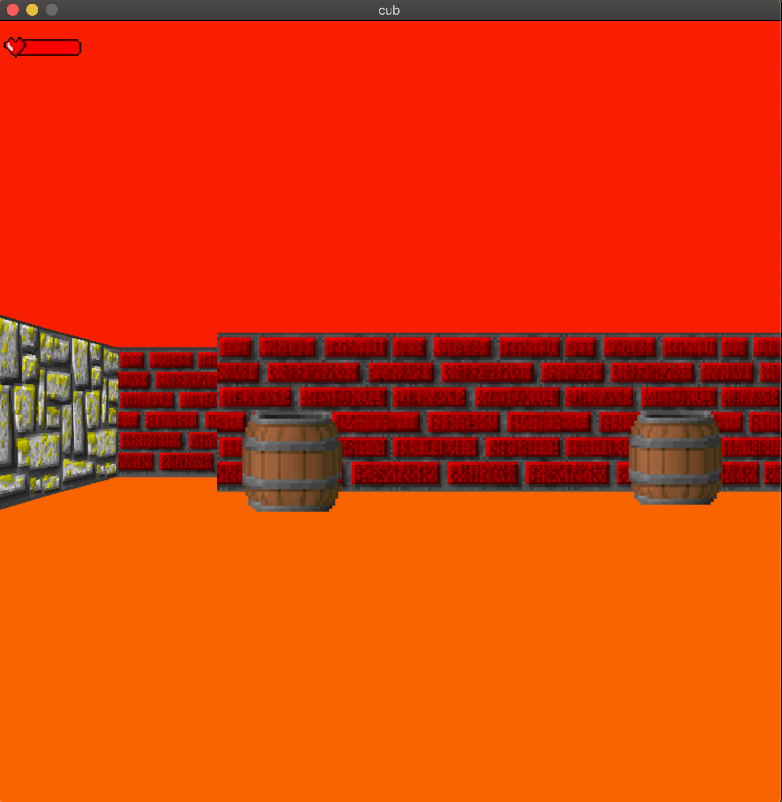
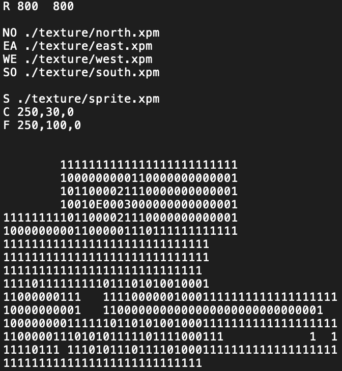

# Cub3D
The goal of ``Cub3D`` is to make *something* using raycasting from scratch with low level C ✨ (like [Wolfenstein 3D](https://fr.wikipedia.org/wiki/Wolfenstein_3D)).

Making this game gave a basic idea on how games are being made, it's was a fun experience.
Althoug It was pain in the arss, managing all memory leaks and function that's make you do yourself.
Enjoy it 🎴

# Usage

``f0rkr@shell» make``  
``f0rkr@shell» ./cub3D map.cub``

You can edit map.cub to change textures and player position, plus sprites.

It also has the feature to screenshot the game and save in a bmp format simply by adding --save to your command.

use: 

``f0rkr@shell» ./cub3D map.cub --save``

# Resources I used:

* [Playable Wolfenstein 3D](http://users.atw.hu/wolf3d/)
* [Raycasting in JS](http://www.playfuljs.com/a-first-person-engine-in-265-lines/)
* [Some X11 event numbers](https://github.com/qst0/ft_libgfx)
* [Full tutorial in English](https://lodev.org/cgtutor/raycasting.html)
* [Full tutorial in French (translation of the English tutorial)](http://forums.mediabox.fr/wiki/tutoriaux/flashplatform/affichage/3d/raycasting)
* [Images in minilibx](https://github.com/keuhdall/images_example)
* [BMP format on StackOverflow](https://stackoverflow.com/questions/2654480/writing-bmp-image-in-pure-c-c-without-other-libraries)
* [BMP format explanation](https://web.archive.org/web/20080912171714/http://www.fortunecity.com/skyscraper/windows/364/bmpffrmt.html)
